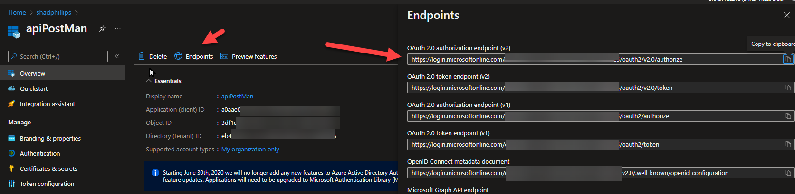

# cc
# Identity - Protected Web APIs that call other protected Web APIs

## This sample shows how to configure Azure AD to support protected service calls to protected Web APIs that call other protected Web APIs. 

## Requirements
* .NET Core 6.0
* Visual Studio or VS Code
* Azure Active Direcotry
* Postman

## Postman Client

In this sample I will use Postman as the client. However, it could also be a web application as well.

## API1 - Client Service API

API1 is a simple Web API written in .NET Core 6.0. It's job is to ensure that the user is authenticated in AAD and has the appropriate rights. , it will then make an service call to API2.

## API2 - Orchestrator API

API2 is acting as an orchestrator or broker to two other downstream APIs, API2a and API2b. Again, ensuring that the upstream API has been authenticated and has the appropriate rights. 

## API2a and API2b - Data retrieval APIs

These APIs are meant to represent calling a datasource, like SQL Server or Cosmos DB. However, the focus of sample is configuring AAD. I'm only returning dummy data that is hardcoded in the APIs.

## Architecture


# AAD Configuration

## API2a App Registration
1. Navigate to the Azure Portal > Azure Active Directory > App Registrations > + New Registration
   
   1. Name: api2a
   2. Account Type: Accounts in the organization directory only
   3. Redirect URI: leave blank.
   4. Then click Register


1. Authentication
   1. Click on + Add a Platform > Web
      * 
   2. Enter the redirect API for the API Application. Which can be found in the api2a project > Properties > launchSettings.json. The format will be https://localhost:<your ports>/signin-oidc
      1. 
      2. 
   3. Select the tokend you would like to be issued by the authoration endpoint: 
      1. Access tokens checked
      2. who can use this application or access vi API?
         1. Accounts in this organizational directory only (single tenant)
  
2. Token configuration
   1. Here you can configure what claims you want to see in the token. As an example I added the auth_time and tenant_ctry claims to the Access Token?
      * 
3. Expose an API
   1. Here you can define scopes that you can use in your application to protect APIs and specific API calls. Click on + Add a scope with the folling information. You wil be prompted to set the Application ID URI. It will looking something like api://<your app id>. Click Save and Continue.
      * Scope naem: api2a.Read
      * Who can consent?: Admins only
      * Admin consent display name: api2a.Read
      * Admin consent description: api2a.Read
      * State: Enabled
      * Click Save
         * 
4. App Roles
   1. Now click on App Roles > + Create app role
      * . Display name: api2a-ReadonlyRole
      *  Allowed member types: User/Groups
      * Value: api2a-ReadonlyRole
      * Description: api2a-ReadonlyRole
      * Do you wan to enable this app role? Checked
      * Click Apply
         1. 
      * We will add a client application later
 1. Manifest
    1. In the Manifest change the following value
        ```json
            "accessTokenAcceptedVersion": null
        ```

    2. To this value
        ```json
            "accessTokenAcceptedVersion": 2
        ```
    3. Click Save

## API2b App Registration
Now let's do the same thing for API2b. We'll add one additional step for API Permmissions. 
1. Navigate to the Azure Portal > Azure Active Directory > App Registrations > + New Registration
   1. Name: api2b
   2. Account Type: Accounts in the organization directory only
   3. Redirect URI: leave blank.
   4. Then click Register
2. Authentication
   1. Click on + Add a Platform > Web
      * 
   2. Enter the redirect API for the API Application. Which can be found in the api2b project > Properties > launchSettings.json. The format will be https://localhost:<your ports>/signin-oidc
   3. Select the tokend you would like to be issued by the authoration endpoint: 
      1. Access tokens checked
      2. who can use this application or access vi API?
         1. Accounts in this organizational directory only (single tenant)
3. Token configuration
   1. Here you can configure what claims you want to see in the token. As an example I added the auth_time and tenant_ctry claims to the Access Token?
4. API Permmissions
   1. Click on + Add a permission > My APIs > api2a
      1. 
      2. Selected Delegated permissions
      3. Select api2a.Read
      4. Click Add permissions
      5. 
      6. Click on Grant admin constent and Yes on the confirmation
      7. 
5. Expose an API
   1. Here you can define scopes that you can use in your application to protect APIs and specific API calls. Click on + Add a scope with the folling information. You wil be prompted to set the Application ID URI. It will looking something like api://<your app id>. Click Save and Continue.
      * Scope naem: api2b.Read
      * Who can consent?: Admins only
      * Admin consent display name: api2b.Read
      * Admin consent description: api2b.Read
      * State: Enabled
      * Click Save
6. App Roles
   1. Now click on App Roles > + Create app role
      * . Display name: api2b-ReadonlyRole
      *  Allowed member types: User/Groups
      * Value: api2b-ReadonlyRole
      * Description: api2b-ReadonlyRole
      * Do you wan to enable this app role? Checked
      * Click Apply
      * We will add a client application later
 1. Manifest
    1. In the Manifest change the following value
        ```json
            "accessTokenAcceptedVersion": null
        ```

    2. To this value
        ```json
            "accessTokenAcceptedVersion": 2
        ```
    3. Click Save

## API2 App Registration
Now let's do the same thing for API2. We'll add one additional step for API Certificate & Secrets. 
1. Navigate to the Azure Portal > Azure Active Directory > App Registrations > + New Registration
   1. Name: api2
   2. Account Type: Accounts in the organization directory only
   3. Redirect URI: leave blank.
   4. Then click Register
2. Authentication
   1. Click on + Add a Platform > Web
   2. Enter the redirect API for the API Application. Which can be found in the api2 project > Properties > launchSettings.json. The format will be https://localhost:<your ports>/signin-oidc
   3. Select the tokend you would like to be issued by the authoration endpoint: 
      1. Access tokens checked
      2. who can use this application or access vi API?
         1. Accounts in this organizational directory only (single tenant)
3. Certificates & secrets
   1. Click on + New client secret
   2. Description: api2 Secret
   3. Expires: 6 months
   4. Click Add - Keep note of the Secret value as you will need it in your api2 appsettings.json file.
   5. 
4. Token configuration
   1. Here you can configure what claims you want to see in the token. As an example I added the auth_time and tenant_ctry claims to the Access Token?
5. API Permmissions
   1. Click on + Add a permission > My APIs > api2a
      1. Selected Delegated permissions
      2. Select api2a.Read
      3. Click Add permissions
      4. Click on Grant admin constent and Yes on the confirmation
   2. Click on + Add a permission > My APIs > api2b
      1. Selected Delegated permissions
      2. Select api2b.Read
      3. Click Add permissions
      4. Click on Grant admin constent and Yes on the confirmation
   3. 
6. Expose an API
   1. Here you can define scopes that you can use in your application to protect APIs and specific API calls. Click on + Add a scope with the folling information. You wil be prompted to set the Application ID URI. It will looking something like api://<your app id>. Click Save and Continue.
      * Scope naem: api2.Read
      * Who can consent?: Admins only
      * Admin consent display name: api2.Read
      * Admin consent description: api2.Read
      * State: Enabled
      * Click Save
7. App Roles
   1. Now click on App Roles > + Create app role
      * . Display name: api2-ReadonlyRole
      *  Allowed member types: User/Groups
      * Value: api2-ReadonlyRole
      * Description: api2-ReadonlyRole
      * Do you wan to enable this app role? Checked
      * Click Apply
      * We will add a client application later
 1. Manifest
    1. In the Manifest change the following value
        ```json
            "accessTokenAcceptedVersion": null
        ```

    2. To this value
        ```json
            "accessTokenAcceptedVersion": 2
        ```
    3. Click Save

## API1 App Registration
Now let's do the same thing for API1. We'll add one additional step for API Certificate & Secrets. 
1. Navigate to the Azure Portal > Azure Active Directory > App Registrations > + New Registration
   1. Name: api1
   2. Account Type: Accounts in the organization directory only
   3. Redirect URI: leave blank.
   4. Then click Register
2.  Authentication
   1. Click on + Add a Platform > Web
   2. Enter the redirect API for the API Application. Which can be found in the api1 project > Properties > launchSettings.json. The format will be https://localhost:<your ports>/signin-oidc
   3. Select the tokend you would like to be issued by the authoration endpoint: 
      1. Access tokens checked
      2. who can use this application or access vi API?
         1. Accounts in this organizational directory only (single tenant)
3. Certificates & secrets
   1. Click on + New client secret
   2. Description: api1 Secret
   3. Expires: 6 months
   4. Click Add - Keep note of the Secret value as you will need it in your api2 appsettings.json file.
4. Token configuration
   1. Here you can configure what claims you want to see in the token. As an example I added the auth_time and tenant_ctry claims to the Access Token?
5. API Permmissions
   1. Click on + Add a permission > My APIs > api2
      1. Selected Delegated permissions
      2. Select api2.Read
      3. Click Add permissions
      4. Click on Grant admin constent and Yes on the confirmation
   2. Click on + Add a permission > My APIs > api2b
      1. Selected Delegated permissions
      2. Select api2.Read
      3. Click Add permissions
      4. Click on Grant admin constent and Yes on the confirmation
6. Expose an API
   1. Here you can define scopes that you can use in your application to protect APIs and specific API calls. Click on + Add a scope with the folling information. You wil be prompted to set the Application ID URI. It will looking something like api://<your app id>. Click Save and Continue.
      * Scope naem: api1.Read
      * Who can consent?: Admins only
      * Admin consent display name: api1.Read
      * Admin consent description: api1.Read
      * State: Enabled
      * Click Save
7. App Roles
   1. Now click on App Roles > + Create app role
      * . Display name: api1-ReadonlyRole
      *  Allowed member types: User/Groups
      * Value: api1-ReadonlyRole
      * Description: api1-ReadonlyRole
      * Do you wan to enable this app role? Checked
      * Click Apply
      * We will add a client application later
 1. Manifest
    1. In the Manifest change the following value
        ```json
            "accessTokenAcceptedVersion": null
        ```

    2. To this value
        ```json
            "accessTokenAcceptedVersion": 2
        ```
    3. Click Save
   
## Postman App Registration
Now let's create the app registration for the Postman client.

1. Navigate to the Azure Portal > Azure Active Directory > App Registrations > + New Registration
   1. Name: apiPostMan
   2. Account Type: Accounts in the organization directory only
   3. Redirect URI: leave blank.
   4. Then click Register
2.  Authentication
   1. Click on + Add a Platform > Single-page application
   2. Enter the redirect URI for the Application. 
      1. https://oauth.pstmn.io/v1/callback
   3. Select the tokend you would like to be issued by the authoration endpoint: 
      1. Access tokens checked
      2. ID tokens checked - we're going to use implicit flow
      3. who can use this application or access vi API?
         1. Accounts in this organizational directory only (single tenant)
4. Token configuration
   1. Here you can configure what claims you want to see in the token. As an example I added the auth_time and tenant_ctry claims to the Access Token.
5. API Permmissions
   1. Click on + Add a permission > My APIs > api1
      1. Selected Delegated permissions
      2. Select api1.Read
      3. Click Add permissions
      4. Click on Grant admin constent and Yes on the confirmation
6. Manifest
    1. In the Manifest change the following value
        ```json
            "accessTokenAcceptedVersion": null
        ```

    2. To this value
        ```json
            "accessTokenAcceptedVersion": 2
        ```
    3. Click Save

## Configure App Registation Client Applications Authorization

### API2a
1. Naviate to Azure AD > App Registrations > api2a > Expose API
   1. Click on + Add a client application and Enter the Application (client) ID of the api2 app registration (this can be found in the Overview section of the registration)
   2. Authorized scopes: Check the api://<appid>/api2a.Read
   3. Click Add application


### API2b
1. Naviate to Azure AD > App Registrations > api2b > Expose API
   1. Click on + Add a client application and Enter the Application (client) ID of the api2 app registration (this can be found in the Overview section of the registration)
   2. Authorized scopes: Check the api://<appid>/api2b.Read
   3. Click Add application
   
### API2
1. Naviate to Azure AD > App Registrations > api2 > Expose API
   1. Click on + Add a client application and Enter the Application (client) ID of the api1 app registration (this can be found in the Overview section of the registration)
   2. Authorized scopes: Check the api://<appid>/api2.Read
   3. Click Add application

### API1
1. Naviate to Azure AD > App Registrations > api1 > Expose API
   1. Click on + Add a client application and Enter the Application (client) ID of the apiPostMan app registration (this can be found in the Overview section of the registration)
   2. Authorized scopes: Check the api://<appid>/api1.Read
   3. Click Add application

## Configure Enterprise applications User and Group Assignment

## API2a

1. Navigate to Azure AD > Enterprise applications > api2a
2. Click on Users and Groups > + Add user/group
3. Add the users or groups you want to add
4. Select a role (api2a-ReadonlyRole should be the only one)


## API2b

1. Navigate to Azure AD > Enterprise applications > api2b
2. Click on Users and Groups > + Add user/group
3. Add the users or groups you want to add
4. Select a role (api2b-ReadonlyRole should be the only one)

## API2

1. Navigate to Azure AD > Enterprise applications > api2
2. Click on Users and Groups > + Add user/group
3. Add the users or groups you want to add
4. Select a role (api2-ReadonlyRole should be the only one)

## API1

1. Navigate to Azure AD > Enterprise applications > api1
2. Click on Users and Groups > + Add user/group
3. Add the users or groups you want to add
4. Select a role (api1-ReadonlyRole should be the only one)

# Solution Projects and Postman Configuration
1. Open the solution in Visual Studio
   
## API1 Project Configuration
1. In the solution navigate to the api1 project > open the appsettings.json file
2. Update the AzureAD Secition and DownstreamApi Section
```json
{
  "AzureAd": {
    "Instance": "https://login.microsoftonline.com/",
    "Domain": "<your domain name>",
    "TenantId": "<your domain tenant Id>",
    "ClientId": "< your api1 application (client) ID",
    "Scopes": "api1.Read",
    "CallbackPath": "/signin-oidc",
    "ClientSecret": "< your secret if you configured one>",
    "ClientCertificates": []
  },
  "Logging": {
    "LogLevel": {
      "Default": "Information",
      "Microsoft.AspNetCore": "Warning"
    }
  },
  "AllowedHosts": "*",
  "DownstreamApi": {
    "Scopes": "api://<api2 application (client id)>/api2.Read",
    "BaseUrl": "https://localhost:44368/api"
  }
}
```

## API2 Project Configuration
1. In the solution navigate to the api2 project > open the appsettings.json file
2. Update the AzureAD Secition and DownstreamApi Section
```json
{
  "AzureAd": {
    "Instance": "https://login.microsoftonline.com/",
    "Domain": "<your domain name>",
    "TenantId": "<your domain tenant Id>",
    "ClientId": "< your api1 application (client) ID>",
    "Scopes": "api2.Read",
    "CallbackPath": "/signin-oidc",
    "ClientSecret": "< your secret if you configured one>",
    "ClientCertificates": []
  },
  "Logging": {
    "LogLevel": {
      "Default": "Information",
      "Microsoft.AspNetCore": "Warning"
    }
  },
  "AllowedHosts": "*",
  "DownstreamApi2a": {
    "Scopes": "api://<api2a application (client id)>/api2a.Read",
    "BaseUrl": "https://localhost:44355/api"
  },

  "DownstreamApi2b": {
    "Scopes": "api://<api2b application (client id)>/api2b.Read",
    "BaseUrl": "https://localhost:44394/api"
  }
}
```
## API2a Project Configuration
1. In the solution navigate to the api2a project > open the appsettings.json file
2. Update the AzureAD Secition
```json
{
  "AzureAd": {
    "Instance": "https://login.microsoftonline.com/",
    "Domain": "<your domain name>",
    "TenantId": "<your domain tenant Id>",
    "ClientId": "< your api1 application (client) ID>",
    "Scopes": "api2a.Read",
    "CallbackPath": "/signin-oidc"
  },
  "Logging": {
    "LogLevel": {
      "Default": "Information",
      "Microsoft.AspNetCore": "Warning"
    }
  },
  "AllowedHosts": "*"
}
```

## API2b Project Configuration
1. In the solution navigate to the api2b project > open the appsettings.json file
2. Update the AzureAD Secition
```json
{
  "AzureAd": {
    "Instance": "https://login.microsoftonline.com/",
    "Domain": "<your domain name>",
    "TenantId": "<your domain tenant Id>",
    "ClientId": "< your api1 application (client) ID>",
    "Scopes": "api2b.Read",
    "CallbackPath": "/signin-oidc"
  },
  "Logging": {
    "LogLevel": {
      "Default": "Information",
      "Microsoft.AspNetCore": "Warning"
    }
  },
  "AllowedHosts": "*"
}
```
## Run the solution
1. Ensure the solution is configured to run all the API Project
2. Right Click on the Solution > Properties > Startup Project
3. Select Multiple startup project and set all of them to run except models

4. Click OK
5. In the tool bar Click on Start

6. You should see all 4 APIs start
   

## Set Breakpoints

Set breakpoints in each of the projects so we can look at the tokens.

1. In the api1 project open Controllers/ProfileProductsController.cs and set a breakpoint on line 30.

1. In the api2 project open Controllers/OrchestratorController.cs and set a breakpoint on line 31

1. In the api2a project open Controllers/ProfileController.cs and set a breakpoint on line 41.

1. In the api2b project open Controllers/ProfileController.cs and set a breakpoint on line 37


## Configure Postman and Test API

1. Create a Collection in Postman named API Calls
2. Add a new request to the collcation named API1
   1. Type GET
   2. Request Url: The URL to your API1 (e.g. https://localhost:44333/api/ProfileProducts/GetProfileProducts/1) . 
   3. Click on the Authorization Tab and set the following values:
      1. Type: Oauth 2.0
      2. Ad authorization data to: Request Headers
      3. Current Token
         1. Access Token: token from authenticating
      4. Configure New Token:
         1. Grant Type: Implicit
         2. Callback URL: https://oauth.pstmn.io/v1/callback
         3. Auth URL: Get this from the apiPostMan App Registration Endpoints
            1. 
         4. Client ID: Application (client) ID for the apiPostMan app registration
         5. Scope: api://<api1 application (client) ID>/api1.Read
         6. Client Authentication: Send as Basic Auth header
   4. Click on Get New Access Token
      1. 
   5. This will prompt you to authenticate against your AAD tenant. Ensure you login with a user that assigned the App Role Permissions. 
   6. Click on Use Token
      1. 
   

## Send the request, debug, and inspect tokens

1. Now that Postman is configured to call your API and you have avalid token. Click Send.

1. The api1 project should break.
2. Add a watch for HttpContext.Request.Headers.Authorization

1. Right click on the watch and Copy Value. Open a browser and navigate to https://jwt.ms and past the value into the test box. You will have to remove '{Bearer ' from the beginning of the value and '}' from the end of the value
2. Inspect the token for roles, scopes (scp), and claims (auth_time, tenant_ctry).

1. In Visual Studio click Continue to keep inspecting the token in each of the APIs that are called hitting the breakpoints.
2. Once you have gone through all the breakpoints and continued the applicaiton. You should see the data results in Postman.


